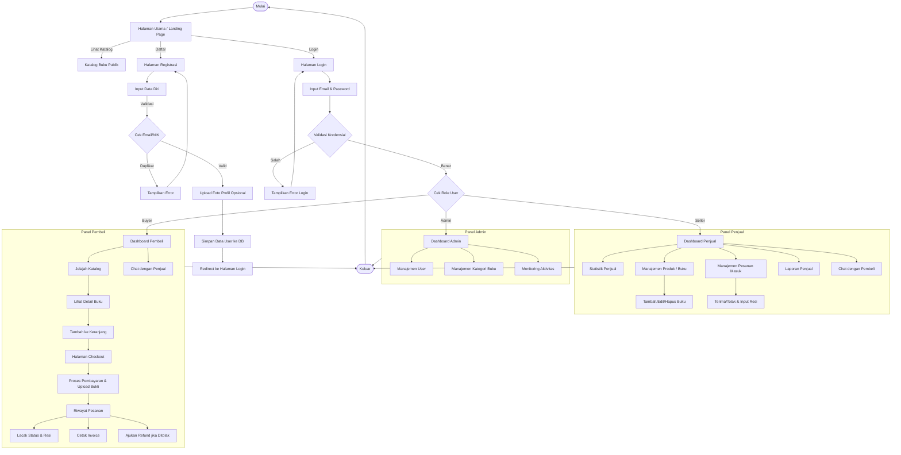

# Flowchart Projek Libraria

Berikut adalah alur kerja sistem (flowchart) untuk aplikasi marketplace buku **Libraria**. Diagram ini menggambarkan interaksi pengguna mulai dari halaman utama, proses autentikasi, hingga fitur-fitur yang tersedia berdasarkan peran (Admin, Seller, Buyer).

