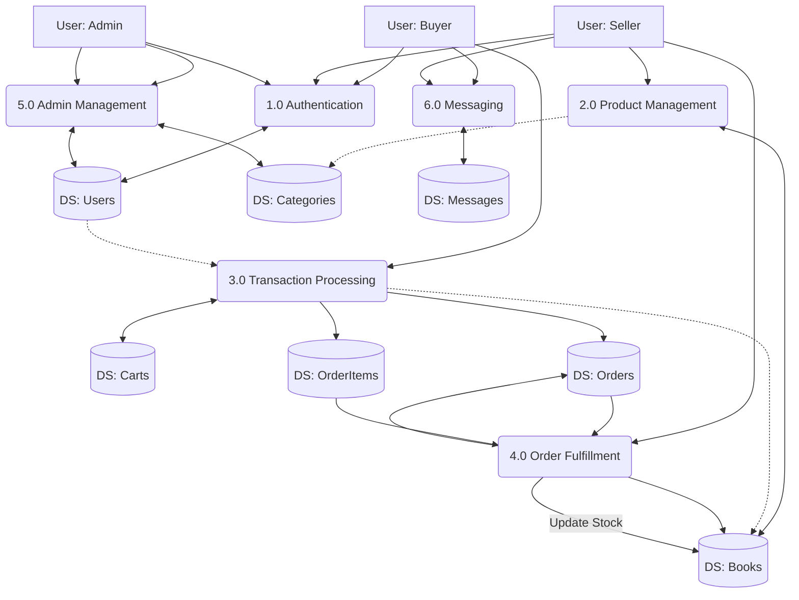

# Data Flow Diagrams (DFD) - Libraria

Dokumen ini menjelaskan alur data dalam sistem Libraria mulai dari Level 0 (Context Diagram), Level 1 (Overview), hingga Level 2 (Detailed Process).

## DFD Level 0: Context Diagram

Diagram ini menggambarkan interaksi antara sistem "Libraria" dengan entitas eksternal (Buyer, Seller, Admin).

```mermaid
graph TD
    %% Entities
    Buyer[User: Buyer]
    Seller[User: Seller]
    Admin[User: Admin]
    System(Libraria System)

    %% Flows: Buyer -> System
    Buyer -->|Login Credentials| System
    Buyer -->|Search Keywords| System
    Buyer -->|Cart Items| System
    Buyer -->|Order Details & Address| System
    Buyer -->|Payment Proof| System
    Buyer -->|Chat Message| System

    %% Flows: System -> Buyer
    System -->|Book Catalog & Details| Buyer
    System -->|Invoice & Order Status| Buyer
    System -->|Chat Reply| Buyer

    %% Flows: Seller -> System
    Seller -->|Login Credentials| System
    Seller -->|Book Data (Add/Edit/Delete)| System
    Seller -->|Order Status Update (Approve/Reject)| System
    Seller -->|Shipping Info (Resi)| System
    Seller -->|Chat Reply| System

    %% Flows: System -> Seller
    System -->|New Order Notification| Seller
    System -->|Sales Report| Seller
    System -->|Chat Message| Seller

    %% Flows: Admin -> System
    Admin -->|Login Credentials| System
    Admin -->|User Management Data| System
    Admin -->|Category Data| System

    %% Flows: System -> Admin
    System -->|User Reports| Admin
    System -->|System Statistics| Admin
```

---

## DFD Level 1: System Overview

Diagram ini memecah sistem menjadi proses-proses utama dan interaksinya dengan Data Store (Database).



---

## DFD Level 2: Order Processing & Fulfillment

Diagram ini menjelaskan secara rinci sub-proses dalam **Process 3.0 (Transaction)** dan **Process 4.0 (Fulfillment)**.

```mermaid
graph TD
    %% Entities
    Buyer[User: Buyer]
    Seller[User: Seller]

    %% Data Stores
    DS_Carts[(DS: Carts)]
    DS_Orders[(DS: Orders)]
    DS_OrderItems[(DS: OrderItems)]
    DS_Books[(DS: Books)]

    %% Process 3.0: Transaction Breakdown
    subgraph "Process 3.0: Transaction Processing"
        P3_1(3.1 Manage Cart)
        P3_2(3.2 Checkout & Split Order)
        P3_3(3.3 Upload Payment Proof)
    end

    %% Process 4.0: Fulfillment Breakdown
    subgraph "Process 4.0: Order Fulfillment"
        P4_1(4.1 Verify Payment)
        P4_2(4.2 Approve/Reject Order)
        P4_3(4.3 Input Shipping Info)
    end

    %% Flows: Transaction (Buyer)
    Buyer -->|Add/Remove Item| P3_1
    P3_1 <-->|Read/Write| DS_Carts

    P3_1 -->|Proceed to Checkout| P3_2
    DS_Books -.->|Read Price & Stock| P3_2
    P3_2 -->|Create Order Record| DS_Orders
    P3_2 -->|Create Item Details| DS_OrderItems
    P3_2 -->|Clear Cart| DS_Carts

    Buyer -->|Upload Image| P3_3
    P3_3 -->|Update Proof| DS_Orders

    %% Flows: Fulfillment (Seller)
    DS_Orders -->|Read Pending Orders| P4_1
    Seller -->|View Proof| P4_1

    P4_1 -->|Valid/Invalid| P4_2
    Seller -->|Action: Approve/Reject| P4_2
    P4_2 -->|Update Status| DS_Orders
    P4_2 -->|Deduct/Restore Stock| DS_Books

    P4_2 -->|If Approved| P4_3
    Seller -->|Input Resi| P4_3
    P4_3 -->|Update Status (Shipping)| DS_Orders
```
