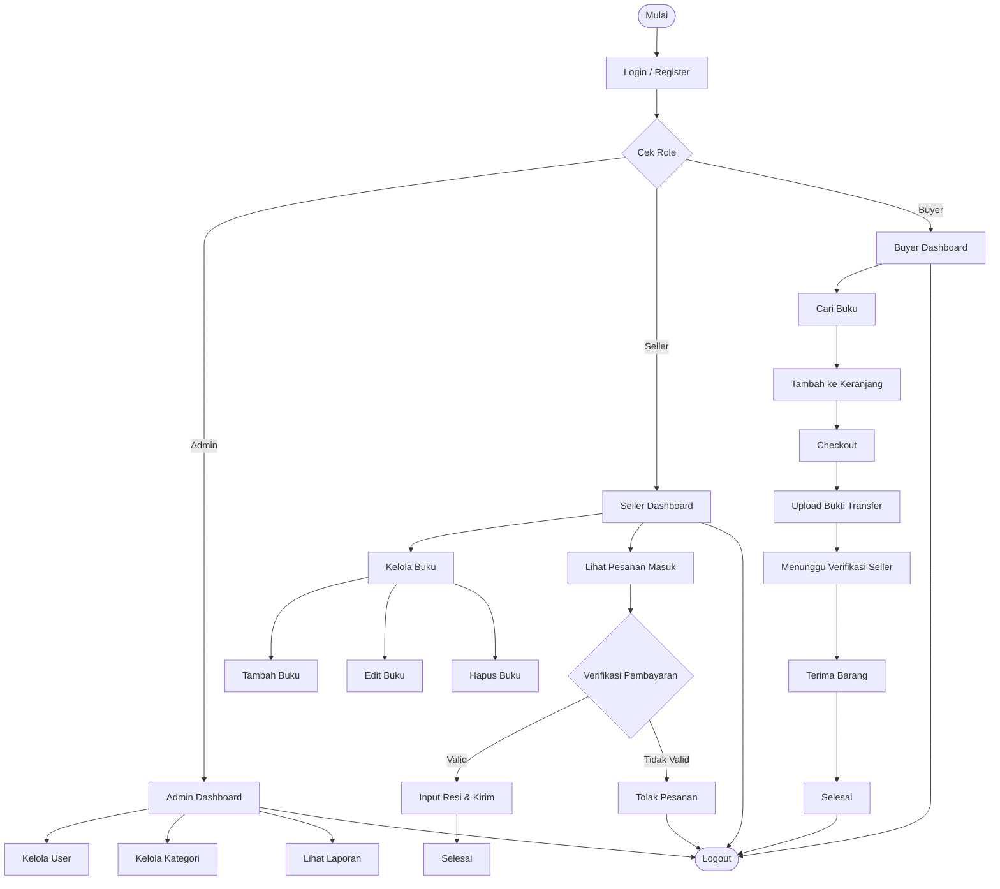
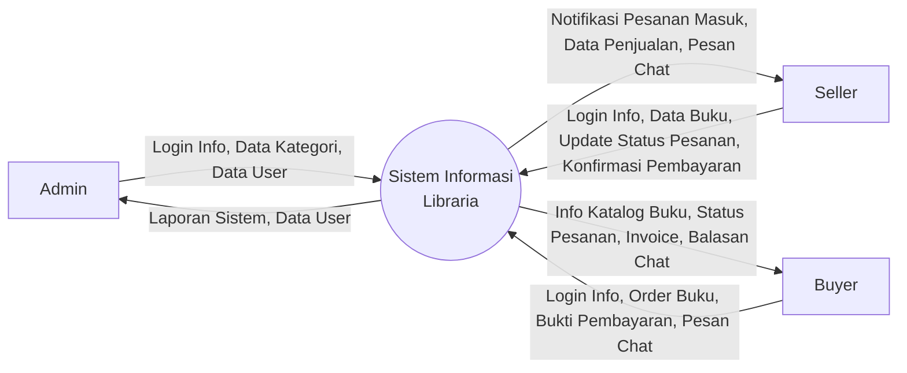
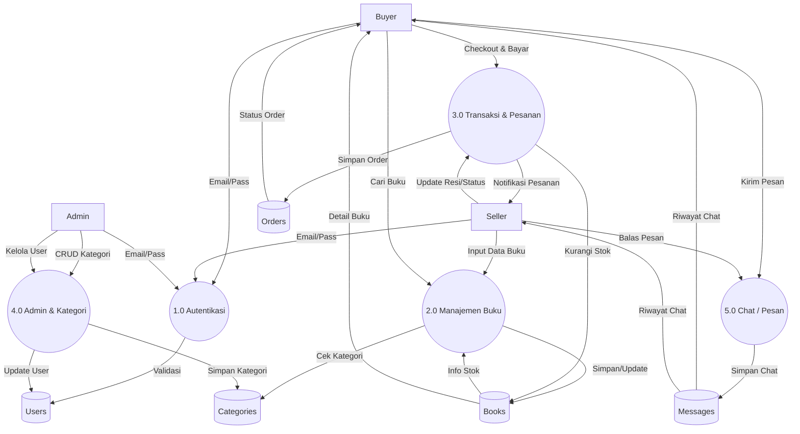
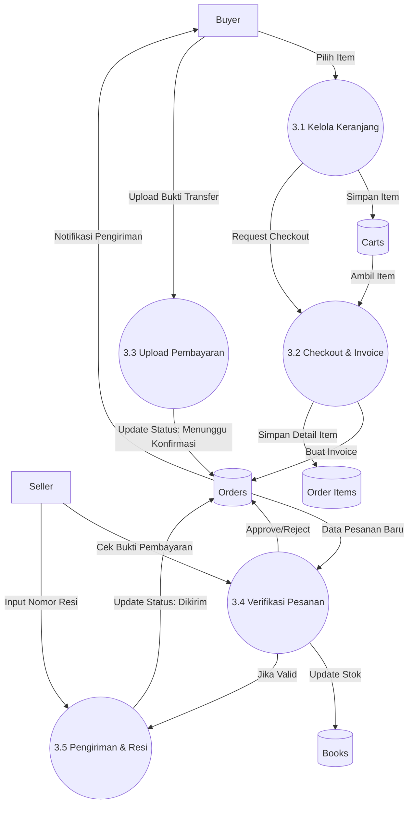

# Diagram Sistem Libraria

Berikut adalah visualisasi alur kerja dan data flow diagram untuk sistem Libraria.

## 1. Flowchart Sistem (Alur Pengguna)

Diagram ini menggambarkan alur perjalanan pengguna (User Journey) mulai dari Login hingga proses utama masing-masing role.

## 2. Data Flow Diagram (DFD) Level 0 - Context Diagram

Diagram Konteks menggambarkan batasan sistem dan interaksi dengan entitas eksternal.

## 3. Data Flow Diagram (DFD) Level 1

Diagram ini memecah sistem menjadi proses-proses utama.

## 4. Data Flow Diagram (DFD) Level 2 - Proses Transaksi (3.0)

Detail dari proses Transaksi & Pesanan.

